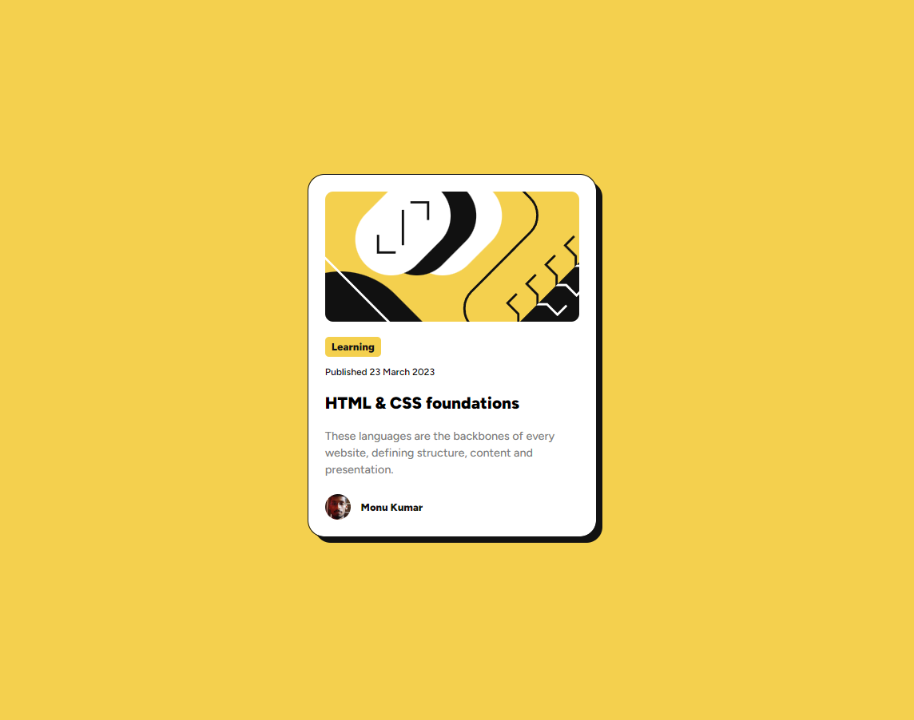
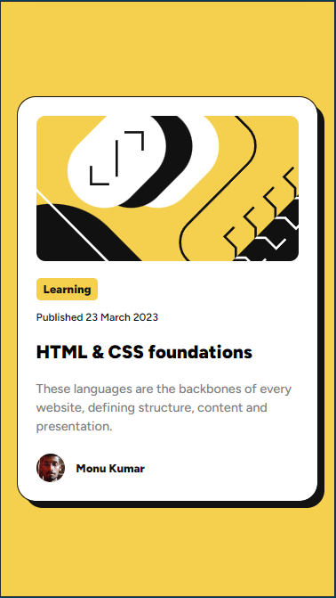

# Frontend Mentor - Blog preview card solution

This is a solution to the [Blog preview card challenge on Frontend Mentor](https://02-blog-preview-card.netlify.app/). 

## Table of contents

- [Overview](#overview)
  - [The challenge](#the-challenge)
  - [Screenshot](#screenshot)
  - [Links](#links)
- [My process](#my-process)
  - [Built with](#built-with)
  - [What I learned](#what-i-learned)
  - [Continued development](#continued-development)
- [Author](#author)
- [Acknowledgments](#acknowledgments)

## Overview

### The challenge

### Screenshot

Desktop view.

 

Mobile view.

### Links

- Solution URL: [on monukd github]()
- Live Site URL: [live project on netlify]()

## My process

Analyse the visuals of the challange think about the markup then code and after that apply styling.

### Built with

- HTML
- CSS
- Flex-Box

### What I learned

- Learned to code some real-world stuff.
- Responsiveness using min, max height and width.
- Creating only by seeing design visually and taking assumption on dimensions.

### Continued development

I'll create some more projects like this before creating a whole website that would help me to achieve my main goal easily...

## Author

- GitHub - [monukd01dev](https://github.com/monukd01dev)
- Frontend Mentor - [@monukd01dev](https://www.frontendmentor.io/profile/monukd01dev)
- Twitter - [@monukd01dev](https://www.twitter.com/monukd01dev)

## Acknowledgments

Calmness and peace of mind is very important to code in CSS and writing structure in HTML, although this project is pretty simple I haven't need any help but I have used Gemini to recall some topography properties of css(I have forget about letter-spacing :).

